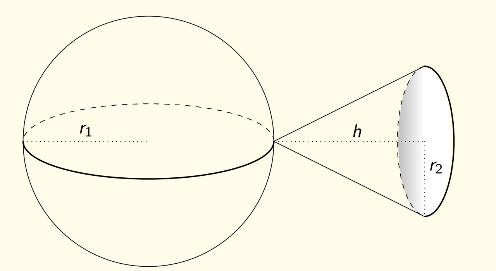
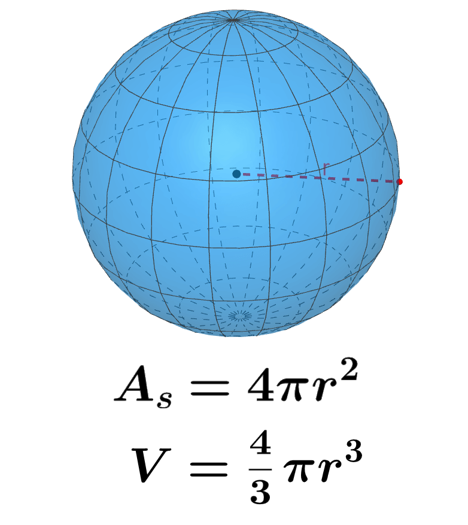
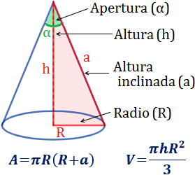
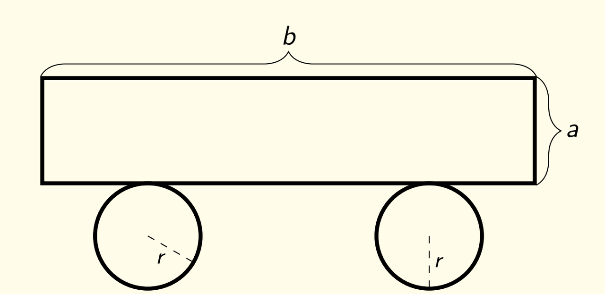
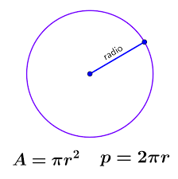
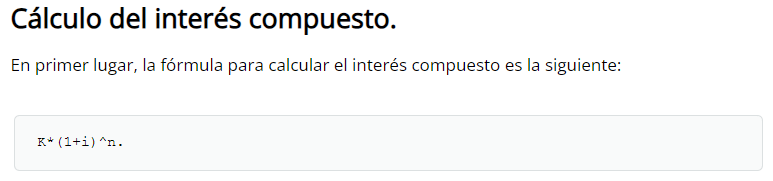

# RETO-6

### Miguel Angel Acevedo

#### PUNTO 1

Dado la figura de la imagen, desarrolle:



 
Una función matemática para calcular el volumen y el área superficial.
Cree dos funciones en python para calcular los valores antes establecidos, al ingresar por teclado r1, r2 y h.
Revise como utilizar el valor de pi usando import math y math.pi

Para este punto importamos la libreria math, y además importamos math.pi, que nos da el valor exacto del número, permitiendonos obtener valores exactos tanto del area como de la superficie

ESFERA AREA SUPERFICIAL Y VOLUMEN



CONO AREA SUPERFICIAL Y VOLUMEN



En base a eso desarrollamos el siguiente codigo:

```
import math as m #importar libreria math
p= m.pi #importar el valor exacto de pi
def Volumen_figura(radio1:float, altura_cono:float, radio2:float) -> float:
  vol = ((4*p*(radio1**3))/3) + ((altura_cono*p*(radio2**2))/3)
  return vol  #se definio la variable del volumen

def Area_superficial_figura(radio1:float, altura_cono:float, radio2:float) -> float:
  area_sup = (4*p*(radio1**2)) + (p*radio2*(radio2+((radio2**2)+(altura_cono**2)**0.5)))
  return area_sup #se definio la variable del area superficial

if __name__ == "__main__":
  radio1 = float(input("El radio de la esfera:"))
  altura_cono = float(input("La altura del cono:"))
  radio2 = float(input("El radio del cono:"))
  volumen = Volumen_figura(radio1, altura_cono, radio2)
  area_superficial = Area_superficial_figura(radio1, altura_cono, radio2)
  print("El volumen de la figura es " + str(volumen)+ " y el area superficial es " +str(area_superficial)) #se puso condicional if que defina las variables con teclado y me imprima los valores de volumeny area superficial

```

#### PUNTO 2

Dado la figura de la imagen, desarrolle:



Una función matemática para calcular el área y el perimetro.
Cree dos funciones en python para calcular los valores antes establecidos, al ingresar por teclado r, a y b.
Revise como utilizar el valor de pi usando import math y math.pi

Consideramos el area de una figura como la base por su altura, y el perimetros 2*base + 2*altura y la siguiente imagen para referenciar el area y permietro del circulo:



```
import math as m #importar libreria math
p= m.pi #importar el valor exacto de pi
def area_2_figura(base:float, altura:float, radio:float) -> float:
  area_2 = (base*altura) + 2*(p*(radio)**2)
  return area_2  #se definio la variable del Area

def perimetro_2_figura(base:float, altura:float, radio:float) -> float:
  per_2 = ((2*base)+(2*altura)) + (2*p*radio)
  return per_2 #se definio la variable del perimetro

if __name__ == "__main__":
  radio = float(input("El radio del circulo:"))
  base = float(input("La base de la figura:"))
  altura = float(input("La altura de la figura:"))
  area_ = area_2_figura(base, altura, radio)
  perimetro_ = perimetro_2_figura(base, altura, radio)
  print("El area de la figura es " + str(area_)+ " y  area superficial es " +str(perimetro_)) #se puso condicional if que defina las variables con teclado y me imprima los valores de area y permietro
```

#### PUNTO 3

Diseñe una función que calcule la cantidad de carne de aves en kilos si se tienen N gallinas, M gallos y K pollitos cada uno pesando 6 kilos, 7 kilos y 1 kilo respectivamente.

```
masa_gina: int =6
masa_galo: int=7
masa_poll: int=1

#Se definieron las masas de las gallinas, gallos, pollitos, como constantes

import math as m #importar libreria math

def carne_(gallina:float, gallo:float, pollitos:float) -> float:
  c_carne = (gallina*masa_gina + gallo*masa_galo + pollitos*masa_poll)
  return c_carne  #se definio la variable de cantidad de carne


if __name__ == "__main__":
  gallina = float(input("Cantidad de gallinas:"))
  gallo = float(input("Cantidad de gallos:"))
  pollitos = float(input("Cantidad de pollitos:"))
  carne_total = carne_(gallina, gallo, pollitos)
  print("La cantidad de carne es " + str(carne_total)+ " kilos") #se puso condicional if que defina las variables con teclado y me imprima la cantidad total de carne
```

#### PUNTO 4

Mi mamá me manda a comprar P panes a 300 cada uno, M bolsas de leche a 3300 cada una y H huevos a 350 cada uno. Hacer un programa que me diga las vueltas (o lo que quedo debiendo) cuando me da un billete de B pesos.

```
p_pan: int =300
p_lec: int=3300
p_hue: int=350

#Se definieron de los precios del pan, leche y huevos, como constantes

import math as m #importar libreria math

def vueta_mama(panes:float, leche:float, huevos:float, dinero:float) -> float:
  vueltas_ = (dinero- (panes*p_pan + leche*p_lec + huevos*p_hue))
  return vueltas_  #se definio la variable que devuelva la cantidad de dinero que sobro


if __name__ == "__main__":
  panes = float(input("Cantidad de pan:"))
  leche = float(input("Bolsas de leche:"))
  huevos = float(input("Cantidad de huevos:"))
  dinero = float(input("Cuanto dinero te dio tu mami, por favor ingresa billetes considernado moneda colombiana, ejemplo 1000, 2000, sino deberas hasta la madre perro:"))
  total_vueltas = vueta_mama(panes, leche, huevos, dinero)
  if total_vueltas > 0:
    print("La cantidad de dinero que sobro fue " +str(total_vueltas)+ " pesos, puede comprar dulcesitos en secreto")
  elif total_vueltas ==0:
    print("No te quedo dinero pa")
  elif total_vueltas < 0:
    total_vueltas = total_vueltas*(-1)
    print("Papi debes" +str(total_vueltas))  #codigo if que solucione la función, y estableciendo otras condiciones que digan lo que sobro, si no sobro o si quedo debiendo plata
```

#### PUNTO 5
Haga un programa que utilice una función para calcular el valor de un préstamo C usando interés compuesto del i por n meses.

Se considero la formula de interes compuesto de la siguiente imagen:



Siendo k = el monto total
i = el interes
n = el tiempo 

```
def prestamo(cantidad_dinero_prestamo:float, interes:float, meses:float) -> float:
  dinero_en_prestamo = (cantidad_dinero_prestamo*(((1+(interes*0.01)))**meses))
  return dinero_en_prestamo  #se definio la variable para calcular el valor del prestamo


if __name__ == "__main__":
  cantidad_dinero_prestamo = float(input("Ingresa el dinero que deseas que te presten en pesos:"))
  interes = float(input("Ingresa el interes del prestamos:"))
  meses = float(input("Tiempo en el que quieres pagarlo:"))
  prestamo_ = prestamo(cantidad_dinero_prestamo, interes, meses)
  print("El valor del prestamo sera de " +str(prestamo_)+ " pesos, solicitando un dinero total de " +str(cantidad_dinero_prestamo)+ " con un interes de " + str(interes)+ " en un plazo de " +str(meses)+ " meses")
  #codigo if que determina el valor del prestamo
```
#### PUNTO 6

El número de contagiados de Covid-19 en el país de NuncaLandia se duplica cada día. Hacer un programa que diga el número total de personas que se han contagiado cuando pasen D días a partir de hoy, si el número de contagiados actuales es C.


```
d : int=2 #variable constante, sera el hecho de que los contagios se duplican cada día
def covid(dias:float, contagiados_iniciales:float) -> float:
  contagios = (contagiados_iniciales*(d**dias))
  return contagios  #se definio la variable para calcular el número de contagiados


if __name__ == "__main__":
  dias = float(input("Ingresa el número de dias que pasan:"))
  contagiados_iniciales = float(input("Ingresa la cantidad de contagiados inicialmente:"))
  n_contagios = covid(dias, contagiados_iniciales) 
  print("El total de contagiados de covid tras pasar " +str(dias)+ " dias, es "  +str(n_contagios)+ " ,considerando que en el dia 0 habian " +str(contagiados_iniciales)+ " contagiados" )
  #codigo if que determina el número de contagiados
```

#### PUNTO 7
Escriba un programa que pida 5 números reales y calcule las siguientes operaciones usando una función para cada una:

* El promedio
* La mediana
* El promedio multiplicativo (multilplica todos y luego calcula la raíz de la cantidad de operandos)
* Ordenar los números de forma ascendente
* Ordenar los números de forma descendente
* La potencia del mayor número elevado al menor número
* La raíz cúbica del menor número

```
aux_n : float # Se  define la constante, que sera la ayuda para ordenar los numeros

def numeros(numero_1:float, numero_2:float, numero_3:float, numero_4:float, numero_5: float) -> float:
  promedio = ((numero_1 + numero_2 + numero_3 + numero_4 + numero_5)/5)
  return promedio  #se definio la variable para calcular el promedio

def mediana_(numero_1:float, numero_2:float, numero_3:float, numero_4: float, numero_5: float) -> float:


    if numero_1 < numero_2:
      aux_n = numero_2
      numero_2 = numero_1
      numero_1 = aux_n

    if numero_1 < numero_3:
      aux_n = numero_3
      numero_3 = numero_1
      numero_1 = aux_n
    
    if numero_1 < numero_3:
      aux_n = numero_3
      numero_3 = numero_1
      numero_1 = aux_n

    if numero_1 < numero_4:
      aux_n = numero_4
      numero_4 = numero_1
      numero_1 = aux_n
     
    if numero_1 < numero_5:
      aux_n = numero_5
      numero_5 = numero_1
      numero_1 = aux_n
    
    if numero_2 < numero_3:
      aux_n = numero_3
      numero_3 = numero_2
      numero_2 = aux_n
      
    if numero_2 < numero_4:
      aux_n = numero_4
      numero_4 = numero_2
      numero_2 = aux_n

    if numero_2 < numero_4:
      aux_n = numero_4
      numero_4 = numero_2
      numero_2 = aux_n

    if numero_2 < numero_5:
      aux_n = numero_5
      numero_5 = numero_2
      numero_2 = aux_n

    if numero_3 < numero_4:
      aux_n = numero_4
      numero_4 = numero_3
      numero_3 = aux_n
     
    if numero_3 < numero_5:
      aux_n = numero_5
      numero_5 = numero_3
      numero_3 = aux_n

    if numero_4 < numero_5:
      aux_n = numero_5
      numero_5 = numero_4
      numero_4 = aux_n

    return str(numero_3)
    #Se definio una variable que imprime la mediana de los datos

def numeros_(numero_1:float, numero_2:float, numero_3:float, numero_4:float, numero_5: float) -> float:
    promedio_multiplicativo = ((numero_1*numero_2*numero_3*numero_4*numero_5)**0.2)
    return promedio_multiplicativo #se definio la variable para calcular el promedio multiplicativo

def ordas_(numero_1:float, numero_2:float, numero_3:float, numero_4: float, numero_5: float) -> float:

    if numero_1 > numero_2:
      aux_n = numero_2
      numero_2 = numero_1
      numero_1 = aux_n

    if numero_1 > numero_3:
      aux_n = numero_3
      numero_3 = numero_1
      numero_1 = aux_n
    
    if numero_1 > numero_3:
      aux_n = numero_3
      numero_3 = numero_1
      numero_1 = aux_n

    if numero_1 > numero_4:
      aux_n = numero_4
      numero_4 = numero_1
      numero_1 = aux_n
     
    if numero_1 > numero_5:
      aux_n = numero_5
      numero_5 = numero_1
      numero_1 = aux_n
    
    if numero_2 > numero_3:
      aux_n = numero_3
      numero_3 = numero_2
      numero_2 = aux_n
      
    if numero_2 > numero_4:
      aux_n = numero_4
      numero_4 = numero_2
      numero_2 = aux_n

    if numero_2 > numero_4:
      aux_n = numero_4
      numero_4 = numero_2
      numero_2 = aux_n

    if numero_2 > numero_5:
      aux_n = numero_5
      numero_5 = numero_2
      numero_2 = aux_n

    if numero_3 > numero_4:
      aux_n = numero_4
      numero_4 = numero_3
      numero_3 = aux_n
     
    if numero_3 > numero_5:
      aux_n = numero_5
      numero_5 = numero_3
      numero_3 = aux_n

    if numero_4 > numero_5:
      aux_n = numero_5
      numero_5 = numero_4
      numero_4 = aux_n

    return str(numero_1)+' '+str(numero_2)+' '+str(numero_3)+' '+str(numero_4)+' '+str(numero_5)   
    #Se definio una variable que imprime el orden ascendente de los datos

def ordes_(numero_1:float, numero_2:float, numero_3:float, numero_4: float, numero_5: float) -> float:

    if numero_1 < numero_2:
      aux_n = numero_2
      numero_2 = numero_1
      numero_1 = aux_n

    if numero_1 < numero_3:
      aux_n = numero_3
      numero_3 = numero_1
      numero_1 = aux_n
    
    if numero_1 < numero_3:
      aux_n = numero_3
      numero_3 = numero_1
      numero_1 = aux_n

    if numero_1 < numero_4:
      aux_n = numero_4
      numero_4 = numero_1
      numero_1 = aux_n
     
    if numero_1 < numero_5:
      aux_n = numero_5
      numero_5 = numero_1
      numero_1 = aux_n
    
    if numero_2 < numero_3:
      aux_n = numero_3
      numero_3 = numero_2
      numero_2 = aux_n
      
    if numero_2 < numero_4:
      aux_n = numero_4
      numero_4 = numero_2
      numero_2 = aux_n

    if numero_2 < numero_4:
      aux_n = numero_4
      numero_4 = numero_2
      numero_2 = aux_n

    if numero_2 < numero_5:
      aux_n = numero_5
      numero_5 = numero_2
      numero_2 = aux_n

    if numero_3 < numero_4:
      aux_n = numero_4
      numero_4 = numero_3
      numero_3 = aux_n
     
    if numero_3 < numero_5:
      aux_n = numero_5
      numero_5 = numero_3
      numero_3 = aux_n

    if numero_4 < numero_5:
      aux_n = numero_5
      numero_5 = numero_4
      numero_4 = aux_n

    return str(numero_1)+' '+str(numero_2)+' '+str(numero_3)+' '+str(numero_4)+' '+str(numero_5)
    #Se definio una variable que imprime el orden descendente de los datos

def may_elev_men(numero_1:float, numero_2:float, numero_3:float, numero_4: float, numero_5: float) -> float: #Tomamos el codigo de ordenar números y eleveamos el numero_1 (mayor) con el numero_5 (menor)

    if numero_1 < numero_2:
      aux_n = numero_2
      numero_2 = numero_1
      numero_1 = aux_n

    if numero_1 < numero_3:
      aux_n = numero_3
      numero_3 = numero_1
      numero_1 = aux_n
    
    if numero_1 < numero_3:
      aux_n = numero_3
      numero_3 = numero_1
      numero_1 = aux_n

    if numero_1 < numero_4:
      aux_n = numero_4
      numero_4 = numero_1
      numero_1 = aux_n
     
    if numero_1 < numero_5:
      aux_n = numero_5
      numero_5 = numero_1
      numero_1 = aux_n
    
    if numero_2 < numero_3:
      aux_n = numero_3
      numero_3 = numero_2
      numero_2 = aux_n
      
    if numero_2 < numero_4:
      aux_n = numero_4
      numero_4 = numero_2
      numero_2 = aux_n

    if numero_2 < numero_4:
      aux_n = numero_4
      numero_4 = numero_2
      numero_2 = aux_n

    if numero_2 < numero_5:
      aux_n = numero_5
      numero_5 = numero_2
      numero_2 = aux_n

    if numero_3 < numero_4:
      aux_n = numero_4
      numero_4 = numero_3
      numero_3 = aux_n
     
    if numero_3 < numero_5:
      aux_n = numero_5
      numero_5 = numero_3
      numero_3 = aux_n

    if numero_4 < numero_5:
      aux_n = numero_5
      numero_5 = numero_4
      numero_4 = aux_n
    
    potencia_ = numero_1**numero_5

    return potencia_
    #Se definio una variable que imprime el mayor número elevado al menor número

def raiz_m(numero_1:float, numero_2:float, numero_3:float, numero_4: float, numero_5: float) -> float: #Tomamos el codigo de ordenar números y le sacamos la raiz cubica

    if numero_1 < numero_2:
      aux_n = numero_2
      numero_2 = numero_1
      numero_1 = aux_n

    if numero_1 < numero_3:
      aux_n = numero_3
      numero_3 = numero_1
      numero_1 = aux_n
    
    if numero_1 < numero_3:
      aux_n = numero_3
      numero_3 = numero_1
      numero_1 = aux_n

    if numero_1 < numero_4:
      aux_n = numero_4
      numero_4 = numero_1
      numero_1 = aux_n
     
    if numero_1 < numero_5:
      aux_n = numero_5
      numero_5 = numero_1
      numero_1 = aux_n
    
    if numero_2 < numero_3:
      aux_n = numero_3
      numero_3 = numero_2
      numero_2 = aux_n
      
    if numero_2 < numero_4:
      aux_n = numero_4
      numero_4 = numero_2
      numero_2 = aux_n

    if numero_2 < numero_4:
      aux_n = numero_4
      numero_4 = numero_2
      numero_2 = aux_n

    if numero_2 < numero_5:
      aux_n = numero_5
      numero_5 = numero_2
      numero_2 = aux_n

    if numero_3 < numero_4:
      aux_n = numero_4
      numero_4 = numero_3
      numero_3 = aux_n
     
    if numero_3 < numero_5:
      aux_n = numero_5
      numero_5 = numero_3
      numero_3 = aux_n

    if numero_4 < numero_5:
      aux_n = numero_5
      numero_5 = numero_4
      numero_4 = aux_n
    
    raiz_ = numero_5**(1/3)

    return raiz_
    #Se definio una variable que imprime la raiz cubica del menor número

if __name__ == "__main__":
  numero_1 = float(input("Ingresa el número 1:"))
  numero_2 = float(input("Ingresa el número 2:"))
  numero_3 = float(input("Ingresa el número 3:"))
  numero_4 = float(input("Ingresa el número 4:"))
  numero_5 = float(input("Ingresa el número 5:"))
  prom = numeros(numero_1, numero_2, numero_3, numero_4, numero_5) 
  print("El promedio de los 5 numeros es " +str(prom))
  mediana = mediana_(numero_1, numero_2, numero_3, numero_4, numero_5) 
  print("La mediana es  " +str(mediana))
  prom_mult = numeros_(numero_1, numero_2, numero_3, numero_4, numero_5) 
  print("El promedio multiplicativo de los 5 números es " +str(prom_mult))
  orden_ascendente = ordas_(numero_1, numero_2, numero_3, numero_4, numero_5)
  print("El orden ascendete de los números es "+str(orden_ascendente))
  orden_descendente = ordes_(numero_1, numero_2, numero_3, numero_4, numero_5)
  print("El orden descendete de los números es "+str(orden_descendente))
  potencia = may_elev_men(numero_1, numero_2, numero_3, numero_4, numero_5)
  print("La potencia del mayor número elevado al menor es "+str(potencia))
  raiz = raiz_m(numero_1, numero_2, numero_3, numero_4, numero_5)
  print("La raiz cúbica del menor número es "+str(raiz))
  #codigo if que determina el promedio de los números, la mediana, promedio multiplicatico, orden de los numeros de forma ascendete y descendente, el mayor número elevado al menor número, y la raiz cubica del menor número

```

#### PUNTO 8

Para el punto anterior incluir las funciones en un archivo independiente e importarlas para su uso, importamos el archivo del punto 7 al nuevo archivo python y utilizamos la función from punto_6_7 import (función que necestiemos)

* Reto#6.81 El promedio
```
  from reto_6_7 import numeros

numero_1 = float(input("Ingresa el número 1:"))
numero_2 = float(input("Ingresa el número 2:"))
numero_3 = float(input("Ingresa el número 3:"))
numero_4 = float(input("Ingresa el número 4:"))
numero_5 = float(input("Ingresa el número 5:"))

prome = numeros(numero_1, numero_2, numero_3, numero_4, numero_5)
print("El promedio de los 5 número es " +str(prome))
```

* Reto#6.82 La mediana
```
from reto_6_7 import mediana_
numero_1 = float(input("Ingresa el número 1:"))
numero_2 = float(input("Ingresa el número 2:"))
numero_3 = float(input("Ingresa el número 3:"))
numero_4 = float(input("Ingresa el número 4:"))
numero_5 = float(input("Ingresa el número 5:"))

mediana_8 = mediana_(numero_1, numero_2, numero_3, numero_4, numero_5)
print("La mediana de los 5 número es " +str(mediana_8))

```
* Reto#6.83 El promedio multiplicativo (multilplica todos y luego calcula la raíz de la cantidad de operandos)
```
from reto_6_7 import numeros_

numero_1 = float(input("Ingresa el número 1:"))
numero_2 = float(input("Ingresa el número 2:"))
numero_3 = float(input("Ingresa el número 3:"))
numero_4 = float(input("Ingresa el número 4:"))
numero_5 = float(input("Ingresa el número 5:"))

promult_8 = numeros_(numero_1, numero_2, numero_3, numero_4, numero_5)
print("El promedio multiplicativo de los 5 números es" +str(promult_8))


```
* Reto#6.84 Ordenar los números de forma ascendente
 ```
from reto_6_7 import ordas_

numero_1 = float(input("Ingresa el número 1:"))
numero_2 = float(input("Ingresa el número 2:"))
numero_3 = float(input("Ingresa el número 3:"))
numero_4 = float(input("Ingresa el número 4:"))
numero_5 = float(input("Ingresa el número 5:"))

orden_ascendente = ordas_(numero_1, numero_2, numero_3, numero_4, numero_5)
print("El orden acendente de los 5 números es " +str(orden_ascendente))

 ```
* Reto#6.85 Ordenar los números de forma descendente
```
rom reto_6_7 import ordes_

numero_1 = float(input("Ingresa el número 1:"))
numero_2 = float(input("Ingresa el número 2:"))
numero_3 = float(input("Ingresa el número 3:"))
numero_4 = float(input("Ingresa el número 4:"))
numero_5 = float(input("Ingresa el número 5:"))

orden_descendente = ordes_(numero_1, numero_2, numero_3, numero_4, numero_5)
print("El orden descendente de los números es " +str(orden_descendente))


```
* Reto#6.86 La potencia del mayor número elevado al menor número
```
from reto_6_7 import may_elev_men

numero_1 = float(input("Ingresa el número 1:"))
numero_2 = float(input("Ingresa el número 2:"))
numero_3 = float(input("Ingresa el número 3:"))
numero_4 = float(input("Ingresa el número 4:"))
numero_5 = float(input("Ingresa el número 5:"))

mayor_numero_elevado_al_menor = may_elev_men(numero_1, numero_2, numero_3, numero_4, numero_5)
print("El mayor número elevado al menor es " +str(mayor_numero_elevado_al_menor))

```
* Reto#6.87 La raíz cúbica del menor número
```
from reto_6_7 import raiz_m

numero_1 = float(input("Ingresa el número 1:"))
numero_2 = float(input("Ingresa el número 2:"))
numero_3 = float(input("Ingresa el número 3:"))
numero_4 = float(input("Ingresa el número 4:"))
numero_5 = float(input("Ingresa el número 5:"))

raiz_menor_número = raiz_m(numero_1, numero_2, numero_3, numero_4, numero_5)
print("La raúz cubica del menor número es " +str(raiz_menor_número))
  ```

#### PUNTO 9

Consultar qué es y cómo funciona pip en python:

Pip (Pip Instalador de Paquetes o Pip Instalador de Python.1) es utilizado por los programadores como un sistema que permite instalar y administrar diversos paquetes de softare, previamente escritos en python, en otras palabras se puede decir que pip gestiona paquetes. 

Para poder usarlo se debe tener previamente instalado python en nuestro computadores, para comprobarlo abre simbolo sistema (si no sabes no se que haces tan avaanzado en el curso, amablemente puedes volver a clase 1 del repo de este bello profesor y estudiar lo necesario para legar) y tecla el siguiente comando ```python --version```. Si luego de ste comando se muetra Python con un número de versión, signfica que esta intalado (entre mas nueva la versión mejor, ya que se accede a todos los comandos y cosas nuevas). 
 
Si aun no esta instalado puedes hacerlo en la micrsoft store o en google [python](https://www.python.org/downloads/)

Si ya esta instalado puedes continuar con la como mirar pip, para eso en simbolo de sistema, colocaras pip y este te dara todos sus comandos, si pones pip list, te dara los comandos que ya tienes instalados

Para instalar un programa solo hara falta con ingresar el siguiente comando ``` pip install nombre-paquete ```  siendo el paquete los modulos que se desse instalar

Los usuarios tambien pueden desistalar paquetes con el siguiente codigo ``` pip uninstall nombre-paquete ``` 

Para gestionar listas de paquetes y sus versiones a traves de archivos de requisitos, permitiendo una recreación eficaz de un conjunto de paquetes en entornos separados. Esto con la siquiente orden ```pip install -r requisitos.txt```

Para instalar un paquete pero para una versión concreta de python es necario el siguiente codigo ```pip${versión} install nombre-paquete```

#### PUNTO 10

Hacer un listado de módulos populares para python que se puedan instalar com pip y consultar cómo instalarlos

* NumPy: Biblioteca fundamental para computación numérica en Python. ```pip install numpy```
* Pandas: Herramienta de manipulación y análisis de datos de alto rendimiento. ```pip install pandas```
* Matplotlib: Biblioteca para crear visualizaciones y gráficos. ```pip install matplotlib```
* Seaborn: Biblioteca para mejorar y simplificar la creación de visualizaciones estadísticas. ```pip install seaborn```
* Scikit-Learn: Biblioteca de aprendizaje automático con herramientas para clasificación, regresión, clustering, etc. ```pip install scikit-learn```
* TensorFlow: Framework de aprendizaje profundo desarrollado por Google. ```pip install tensorflow```
* PyTorch: Biblioteca de aprendizaje profundo desarrollada por Facebook. ```pip install torch```
* Django: Framework web de alto nivel para desarrollo rápido y seguro. ```pip install django```
* Flask: Microframework web para crear aplicaciones web ligeras. ```pip install flask```
* Requests: Biblioteca para hacer solicitudes HTTP de manera sencilla. ```pip install requests```
* Beautiful Soup: Biblioteca para raspar información de páginas web. ```pip install beautifulsoup4```
* SQLAlchemy: Biblioteca ORM (Mapeo Objeto-Relacional) para trabajar con bases de datos SQL. ```pip install sqlalchemy```
* Flask-SQLAlchemy: Extensión de Flask para integrar SQLAlchemy en aplicaciones Flask. ```pip install flask-sqlalchemy```
* Flask-RESTful: Extensión de Flask para crear API RESTful de manera sencilla. ```pip install flask-restful```
* Django REST framework: Biblioteca para construir API REST en aplicaciones Django. ```pip install djangorestframework```
